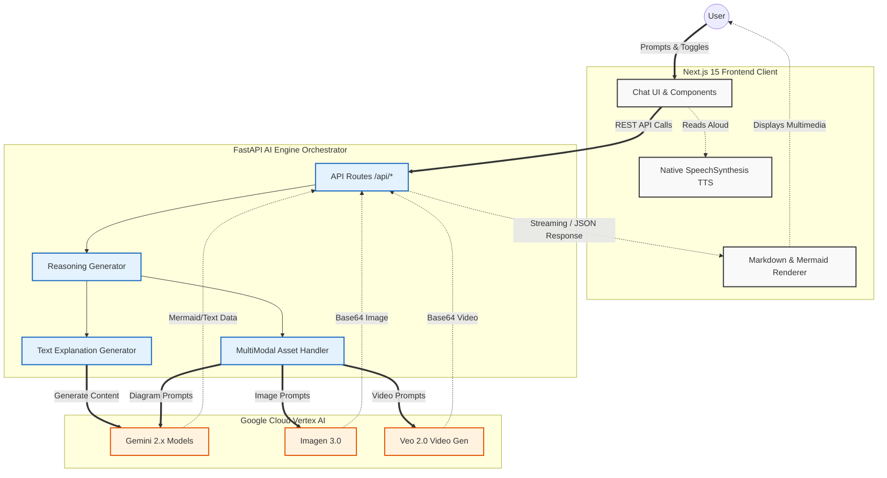

# System Architecture

You can copy the Mermaid code below and paste it into Draw.io (using **Arrange > Insert > Advanced > Mermaid**) or view it using any Markdown previewer that supports Mermaid.js.

